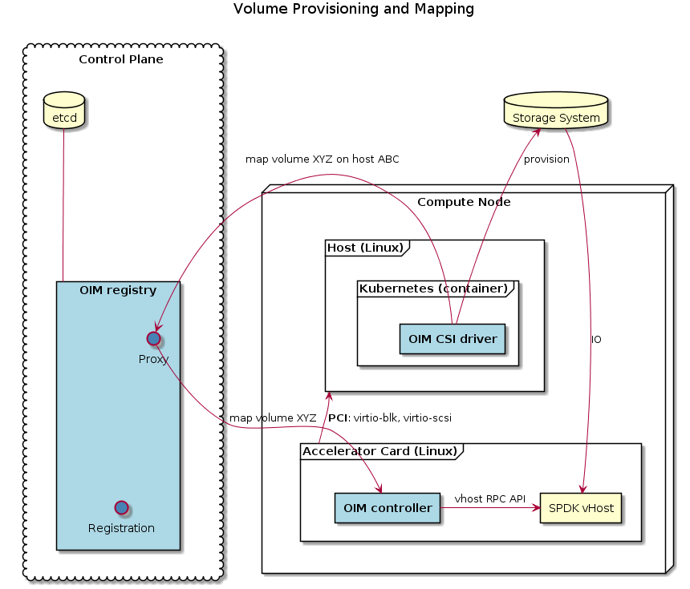
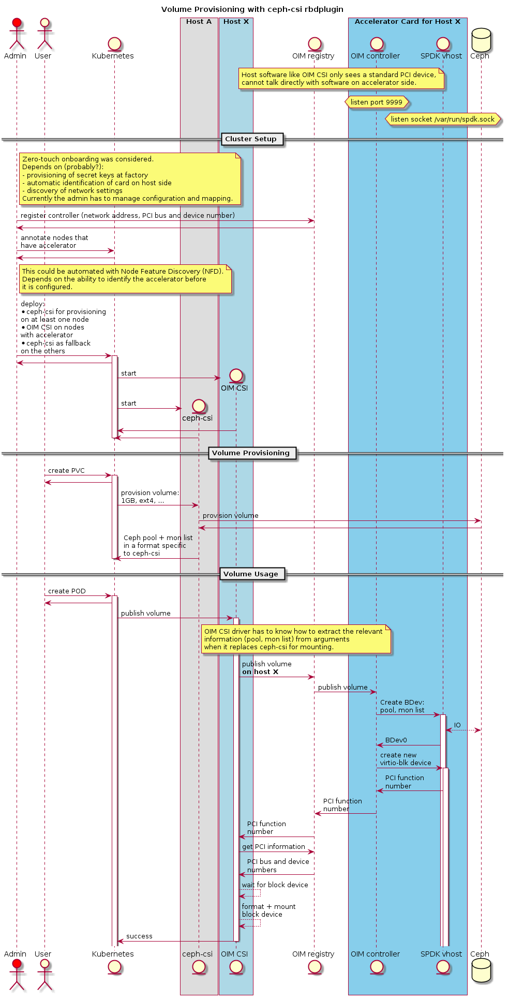

# Open Infrastructure Manager (OIM)

Open Infrastructure Manager (OIM) is an open source project which
simplifies the integration of storage and network accelerator hardware into
cloud environments like Kubernetes, Mesos and OpenStack.

It provides the control plane and plugins to make network storage
available via the
[Storage Performance Development Kit (SPDK)](http://www.spdk.io/)
daemon, both with hardware manager and without. Because SPDK runs in
user space and uses polling extensively, it achieves much better
performance and lower latency than comparable kernel drivers.

## Concepts

### Control Plane

OIM components may be on different networks. This is important for
storage accelerator hardware where the kernel on the main compute node
only sees a standard PCI device, like a SCSI controller, without a way
to issue special commands through that interface. In such a setup,
control of the accelerator hardware has to go through a proxy.

In OIM, this proxy is provided by the control plane where all accelerator
hardware is registered. This control plane is independent of any
particular cloud environment. Its implementation, the OIM registry,
and all other OIM components are implemented in Go. The resulting
binaries do not depend on any other userspace library and thus work on
different distributions.

For testing purposes the OIM registry can be run with a single process
storing all data in memory. A production environment is expected to
use [etcd](https://coreos.com/etcd/) with multiple OIM registry
instances as frontend to increase scalability. Communication with the
control plane is limited to short-lived, infrequent connections.

### Storage + CSI

Provisioning new block volumes is specific to the storage provider and
therefore requires additional components that know how to control
certain storage providers.

The main goal for OIM itself is to make already provisioned network
attached block volumes available as local block devices. Depending on
the cloud environment, either the block devices or filesystems mounted
on top of the devices will then be used by applications.

OIM implements a
[Container Storage Interface(CSI)](https://github.com/container-storage-interface/spec)
driver which can be used by any container orchestrator that supports
CSI. Operation as part of Kubernetes is specifically tested. The
`deploy/kubernetes` directory contains `.yaml` files that show how to
deploy OIM on Kubernetes.

Real deployments are expected to consist of:
- some third-party CSI driver for volume provisioning
- that same third-party CSI driver for mounting on nodes
  *without* hardware acceleration
- the OIM CSI driver in "emulation" mode for that driver
  for mounting on nodes *with* hardware acceleration

The OIM CSI driver needs to understand the parameters that it is
getting passed when asked to mount a volume. These parameters are
defined by the third-party driver and not standardized, therefore
compile-time extensions of the OIM CSI driver are needed to support
other third-party drivers - see
[`ceph-csi.go`](pkg/oim-csi-driver/ceph-csi.go) for an example. All
supported drivers are described below.

### Controller ID

Each accelerator hardware instance has its own controller. They get
identified by an ID that is unique for all instances connected to the
same control plane. This unique ID is used to route requests to the
right OIM controller via the OIM registry.

When deploying one OIM registry per cluster with unique host names
inside that cluster, the host name can be used as controller ID. This
removes the need to configure or auto-detect the controller ID on the
host system and is therefore the default in the OIM CSI driver. More
complex deployment scenarios are still possible.

## Components

### OIM Registry

The OIM registry keeps track of accelerator hardware and the
corresponding OIM controller in a key/value database and uses that
information to proxy requests from clients to the OIM
controllers. This is relevant when clients and the controllers are on
different networks or when the clients do not know the network address
of the controllers.

Conceptually the database stores string values with a set of string
path elements as key. All strings are UTF-8 encoded. The slash (`/`)
is used to separate path elements and thus cannot appear in a path
element itself. Leading and trailing slashes are ignored and repeated
slashes are treated like a single slash.

Some keys have a special meaning and are used by OIM itself, while the
others can be used to store arbitrary meta information about an
accelerator. The special keys are:

* `<controller ID>/address`: the gRPC name that is given to
  [Go gRPC Dial](https://godoc.org/google.golang.org/grpc#Dial) to
  establish a connection from the registry to the OIM controller.  The
  syntax is defined by the
  [gRPC Name Resolution](https://github.com/grpc/grpc/blob/master/doc/naming.md).
  Supported are currently TCP (`dns:[//authority/]host[:port]`) and
  Unix domain sockets (`unix:path` or `unix://absolute_path`).
* `<controller ID>/pci`: the PCI address of the accelerator card,
  in extended bus/device/function (BDF) notation ([domain:]bus:device:function,
  all in hex, with optional leading zeros). Unknown values that will
  be supplied at runtime by the OIM controller can be set to zero,
  they will be replaced.

Depending on the storage backend for the registry database, deployments
may consist of:
* a single instance when storing the registry in memory (only for
  testing purposes)
* a set of daemons when storing the registry in etcd

Even when deploying redundant OIM registry daemons, conceptually there
is only one OIM registry.

### OIM Controller

There is one OIM controller per accelerator hardware device. The OIM
controller responds to requests that control the operation of the
hardware.

If provided with the necessary information (which controller ID to
use, registry endpoint, its own external endpoint), the OIM controller
can register the hardware with the OIM registry on startup and at
regular intervals, to recover from a potential loss of the registry
DB.

But this is optional. This mapping can also be configured manually
with the oim-registry-tool (NOT YET IMPLEMENTED).

### OIM CSI Driver

Connects to the OIM registry to find the OIM controller for the
hardware attached to the compute node. It uses that controller to
map or unmap volumes.

### SPDK

The [SPDK vhost daemon](http://www.spdk.io/doc/vhost.html) is used to
access network attached block volumes via protocols like iSCSI, Ceph,
or NVMeOF. The OIM controller reconfigures SPDK such that these block
devices appear as new disks on the local node.

When used without special accelerator hardware, SPDK and OIM CSI driver
run on the same Linux kernel. The driver controls the SPDK daemon
directly and OIM registry and controller are not needed. Volumes are
made available via that Linux kernel as network block devices
([NBD](https://nbd.sourceforge.io/)) with SPDK handling the actual
network communication.

When used with accelerator hardware, SPDK runs on separate hardware and
the volumes appear as new SCSI devices on the same virtio SCSI
controller (VHost SCSI). In the future, dynamically attaching new
virtio block controllers for each new volume might also be supported.

## Security

All communication is protected by mutual TLS. Both client and server
must identify themselves and the certificate they present must be
trusted. The common name in each certificate is used to identify the
different components and authorizes certain operations. The following
common names have a special meaning:

- `component.registry` is used by the OIM registry.
- `user.admin` is used by privileged clients talking to the OIM
  registry and everything else with a `user.` prefix for
  non-privileged clients.
- `user.<anything else>` is used by unprivileged clients talking to
  the OIM registry.
- `host:<controller ID>` is used by a OIM CSI driver which needs to to
  send commands to the controller with that ID.
- `controller.<controller ID>` is used by the OIM controller with that
  ID.

All components trust the registry when it presents a
`component.registry` certificate. The registry accepts connections
only from trusted peers and in addition, checks for `user.admin` in
privileged operations (like `SetValue`) and `host:<controller ID>`
when proxying commands. Connections from the registry proxy to the
controller expect the controller to have `controller.<controller ID>`.

The OIM controller therefore only needs to check that incoming
commands come from the registry and can rely on the registry to ensure
that the command comes from the right OIM CSI driver. Likewise, the
registry protects secrets embedded in commands by verifying the
identity of the controller it connects to and detects configuration
mistakes (like an address that points to the wrong controller).

Certificates and keys get loaded anew for each connection attempt. For
clients, this makes it possible to update secrets without restarting
long-running processes (OIM CSI driver), but servers (OIM registry,
OIM controller) have to be restarted.

The usage instructions below explain how to create and use these
certificates.

## Building

All that is needed for building the core OIM components is a recent Go
toolchain (>= 1.7 should be enough), `bash` and standard POSIX
tools. Building therefore should work on Linux distros, Mac OS X and
even Windows when those additional tools are installed. Testing will
need additional packages, which will be described in the corresponding
sections below.

This repository _**must**_ be checked out at
`$GOPATH/src/github.com/intel/oim`. Then the
top-level Makefile can be used to produce binaries under _work:

    make all

See the [Makefile](./Makefile) for additional make targets.

## Proxy settings

When moving beyond simple building, external resources like images
from Clear Linux or Docker registries are needed. In a corporate
environment where proxies have to be used for HTTP, the following
environment variables will be used to configure proxy usage:

- http_proxy or HTTP_PROXY
- https_proxy or HTTPS_PROXY
- no_proxy or NO_PROXY

Note that Go will try to use the HTTP proxy also for local connections
to `0.0.0.0`, which cannot work. `no_proxy` must contain `0.0.0.0` to
prevent this. The Makefile will add that automatically, but when
invoking test commands directly, it has to be added to `no_proxy`
manually.

When setting up the virtual machine (see below), the proxy env
variables get copied into the virtual machine's
`/etc/systemd/system/docker.service.d/oim.conf` file at the time of
creating the image file. When changing proxy settings later, that file
has to be updated manually (see below for instructions for starting
and logging into the virtual machine) or the image must be created
again after a `make clean`.

## Testing

Simple tests can be run with `make`, `go test` or `dlv test` and don't
have any additional dependencies:

    cd pkg/oim-csi-driver && go test
    make test

More complex tests involve QEMU and SPDK and must be explicitly
enabled as explained in the following sections.

`make test` invokes `go test`, and that command caches test results.
It only runs tests anew if the Go source code was modified since the
last test run. When tests need to be run again because the external
resources (QEMU image, SPDK) or the test configuration variables
changed, then one has to clean the cache first or use a special make
target:

    go clean -testcache
    make force_test

### QEMU + Kubernetes

The `qemu-system-x86_64` binary must be installed, either from
[upstream QEMU](https://www.qemu.org/) or the Linux distribution. The
version must be v2.10.0 or higher because vhost-scsi is required
([SPDK Prerequisites](http://www.spdk.io/doc/vhost.html#vhost_prereqs)).

For networking, the `ip` tool from the `iproute2` package must be
installed. The following command must be run once after booting the
host machine and before starting the virtual machine:

    test/runqemu-ifup 4

This configures four tap devices for use by the current user. At the
moment, the test setup is hard-coded to use:

- `oimtap0/1/2/3`
- `oimbr0`
- 192.168.7.1 for the build host side of the bridge interfaces
- 192.168.7.2/4/6/8 for the virtual machines
- the same DNS server for the virtual machines as on the development
  host

To undo the configuration changes made by `test/runqemu-ifup` when
the tap device is no longer needed, run:

    test/runqemu-ifdown

KVM must be enabled and the user must be allowed to use it. Usually this
is done by adding the user to the `kvm` group. The
["Install QEMU-KVM"](https://clearlinux.org/documentation/clear-linux/get-started/virtual-machine-install/kvm)
section in the Clear Linux documentation contains further information
about enabling KVM and installing QEMU.

To ensure that QEMU and KVM are working, run this:

    make _work/clear-kvm-original.img _work/start-clear-kvm _work/OVMF.fd
    cp _work/clear-kvm-original.img _work/clear-kvm-test.img
    _work/start-clear-kvm _work/clear-kvm-test.img

The result should be login prompt like this:

    [    0.049839] kvm: no hardware support
    
    clr-c3f99095d2934d76a8e26d2f6d51cb91 login: 

The message about missing KVM hardware support comes from inside the
virtual machine and indicates that nested KVM is not enabled. This can
be ignored because it is not needed.

Now the running QEMU can be killed and the test image removed again:

    killall qemu-system-x86_64 # in a separate shell
    rm _work/clear-kvm-test.img
    reset # Clear Linux changes terminal colors, undo that.

Testing with QEMU can be enabled in several different ways. When using
make, these variables can be set in the environment or via the make
parameters.

    make test TEST_QEMU_IMAGE=_work/clear-kvm.img
    cd pkg/qemu && TEST_QEMU_IMAGE=<full path>/_work/clear-kvm.img go test

The `clear-kvm` images are prepared automatically by the Makefile. By
default, four different images are prepared, each pre-configured with
its own hostname and with network settings for the corresponding `tap`
device. `clear-kvm.img` is a symlink to the `clear-kvm.0.img` where
the Kubernetes master node will run.

The images will contain the latest
[Clear Linux OS](https://clearlinux.org/) and have the Kubernetes
version supported by Clear Linux installed.

### SPDK

Running SPDK is [not possible without root privileges](https://github.com/spdk/spdk/issues/314). Mounting
devices also requires root privileges. The impact has been minimized as much as
possible by running most code as normal user in the developer's
environment and only invoking some operations via sudo.

The build machine must be prepared to allow this, huge pages must be
set up so that normal users can access them, and nbd must be available:
* [`sudo`](https://en.wikipedia.org/wiki/Sudo) must be able to run arbitrary commands
* `sudo env HUGEMEM=4096 PCI_WHITELIST="none" vendor/github.com/spdk/spdk/scripts/setup.sh && sudo chmod a+rw /dev/hugepages`
* `sudo modprobe nbd`

Building SPDK depends on additional packages. SPDK
[provides a shell script](https://github.com/spdk/spdk/blob/master/README.md#prerequisites)
for installing those. In OIM, that script can be invoked as:

    sudo ./vendor/github.com/spdk/spdk/scripts/pkgdep.sh

However, the script only covers the dependencies of the core
functionality in SPDK. For Ceph RBD support, `librbd-dev` or some
similar package also needs to be installed.

SPDK will be built automatically from known-good source code bundled in the repository
when selecting it with:

    make test TEST_SPDK_VHOST_BINARY=_work/vhost

Alternatively, one can build and start SPDK manually and then just point
to the RPC socket. For example, this way one can debug and/or monitor SPDK in
more detail by wrapping it in `strace`:

    sudo app/vhost/vhost -S /tmp -r /tmp/spdk.sock & sleep 1; sudo chmod a+rw /tmp/spdk.sock*; sudo strace -t -v -p `pidof vhost` -e 'trace=!getrusage' -s 256 2>&1 | tee /tmp/full.log | grep -v EAGAIN & fg %-
    make test TEST_SPDK_VHOST_SOCKET=/tmp/spdk.sock

### Docker

The e2e tests that get enabled when specifying a QEMU image depend on
a OIM CSI driver image in a local Docker registry and thus need:
* Docker
* a local [Docker registry](https://docs.docker.com/registry/deploying/)

The driver image will be built automatically by the `Makefile` when running
the tests. It can also be built separately with:

    make push-oim-csi-driver

### Full testing

In addition to enabling additional tests individually as explained
above, it is also possible to enable everything at once with:

    make test WITH_E2E_TESTS=1

## Usage

### Starting and stopping a demo cluster

`make start` will bring up a Kubernetes test cluster inside the same
QEMU virtual machines that are also used for testing. It also sets up
the OIM CSI driver inside the cluster and all required additional
tools (OIM registry, OIM controller, SPDK vhost) on the host.

`make start` can be called multiple times in a row and it will attempt
to bring up missing pieces each time it is invoked.

Once it completes, everything is ready for interactive use via
`kubectl` inside the virtual machine. Only the first node in the
cluster is connected to a `virtio-scsi` device provided by the SPDK
daemon on the host, so only that node can use hardware accelerated
storage. It has been labeled with `intel.com/oim=1` to make that
information available to Kubernetes.

There are two `.yaml` files which can be used to create a persistent
volume claim (PVC) and to use that PVC inside a pod:

    $ cat doc/csi-pvc.yaml | _work/ssh-clear-kvm kubectl create -f -
    persistentvolumeclaim/csi-pvc created
    $ cat doc/csi-app.yaml | _work/ssh-clear-kvm kubectl create -f -
    pod/my-csi-app created
    $ _work/ssh-clear-kvm kubectl get pods
    NAME                   READY     STATUS    RESTARTS   AGE
    my-csi-app             1/1       Running   0          1m
    oim-csi-driver-9vffk   4/4       Running   0          11m

The `_work` directory has log files for the tools on the host, and
this command can be used to retrieve the log of the CSI driver:

    $ _work/ssh-clear-kvm kubectl logs -l app=oim-csi-driver -c oim-csi-driver
    INFO listening for connections | address: //csi/csi.sock
    ...
    DEBUG received | method: /csi.v0.Controller/CreateVolume request: name:"pvc-898c46f5c31611e8" capacity_range:<required_bytes:1048576 > volume_capabilities:<mount:<> access_mode:<mode:SINGLE_NODE_WRITER > > 
    DEBUG sending | method: /csi.v0.Controller/CreateVolume method: /oim.v0.Controller/ProvisionMallocBDev request: bdev_name:"pvc-898c46f5c31611e8" size:1048576 
    DEBUG received | method: /csi.v0.Controller/CreateVolume method: /oim.v0.Controller/ProvisionMallocBDev response: <empty>
    DEBUG sending | method: /csi.v0.Controller/CreateVolume response: volume:<capacity_bytes:1048576 id:"pvc-898c46f5c31611e8" > 
    ...
    DEBUG received | method: /csi.v0.Node/NodePublishVolume request: volume_id:"pvc-898c46f5c31611e8" target_path:"/var/lib/kubelet/pods/90076512-c316-11e8-9e2e-deadbeef0100/volumes/kubernetes.io~csi/pvc-898c46f5c31611e8/mount" volume_capability:<mount:<> access_mode:<mode:SINGLE_NODE_WRITER > > volume_attributes:<key:"storage.kubernetes.io/csiProvisionerIdentity" value:"1538135608132-8081-oim-csi-driver" > 
    I0928 12:03:58.582202       1 mount_linux.go:196] Detected OS without systemd
    INFO mounting | method: /csi.v0.Node/NodePublishVolume target: /var/lib/kubelet/pods/90076512-c316-11e8-9e2e-deadbeef0100/volumes/kubernetes.io~csi/pvc-898c46f5c31611e8/mount fstype:  read-only: %!s(bool=false) volumeid: pvc-898c46f5c31611e8 attributes: map[storage.kubernetes.io/csiProvisionerIdentity:1538135608132-8081-oim-csi-driver] flags: []
    DEBUG sending | method: /csi.v0.Node/NodePublishVolume method: /oim.v0.Controller/MapVolume request: volume_id:"pvc-898c46f5c31611e8" malloc:<> 
    DEBUG received | method: /csi.v0.Node/NodePublishVolume method: /oim.v0.Controller/MapVolume response: device:"/devices/pci0000:00/0000:00:15.0/" scsi:"0:0" 
    INFO waiting for block device | method: /csi.v0.Node/NodePublishVolume sys: /sys/dev/block substr: /devices/pci0000:00/0000:00:15.0/ scsi: 0:0
    DEBUG symlink | method: /csi.v0.Node/NodePublishVolume from: /sys/dev/block/254:0 to: ../../devices/pci0000:00/0000:00:03.0/virtio1/block/vda
    DEBUG symlink | method: /csi.v0.Node/NodePublishVolume from: /sys/dev/block/254:1 to: ../../devices/pci0000:00/0000:00:03.0/virtio1/block/vda/vda1
    DEBUG symlink | method: /csi.v0.Node/NodePublishVolume from: /sys/dev/block/254:2 to: ../../devices/pci0000:00/0000:00:03.0/virtio1/block/vda/vda2
    DEBUG symlink | method: /csi.v0.Node/NodePublishVolume from: /sys/dev/block/254:3 to: ../../devices/pci0000:00/0000:00:03.0/virtio1/block/vda/vda3
    ...
    DEBUG symlink | method: /csi.v0.Node/NodePublishVolume from: /sys/dev/block/8:0 to: ../../devices/pci0000:00/0000:00:15.0/virtio3/host0/target0:0:0/0:0:0:0/block/sda
    DEBUG found block device | method: /csi.v0.Node/NodePublishVolume entry: 8:0 dev: sda
    I0928 12:03:58.606731       1 mount_linux.go:196] Detected OS without systemd
    I0928 12:03:58.606756       1 mount_linux.go:472] Checking for issues with fsck on disk: /dev/sda497338321/sda
    I0928 12:03:58.610058       1 mount_linux.go:491] Attempting to mount disk:  /dev/sda497338321/sda /var/lib/kubelet/pods/90076512-c316-11e8-9e2e-deadbeef0100/volumes/kubernetes.io~csi/pvc-898c46f5c31611e8/mount
    I0928 12:03:58.610188       1 mount_linux.go:143] Mounting cmd (mount) with arguments ([-o defaults /dev/sda497338321/sda /var/lib/kubelet/pods/90076512-c316-11e8-9e2e-deadbeef0100/volumes/kubernetes.io~csi/pvc-898c46f5c31611e8/mount])
    E0928 12:03:58.611787       1 mount_linux.go:148] Mount failed: exit status 255
    Mounting command: mount
    Mounting arguments: -o defaults /dev/sda497338321/sda /var/lib/kubelet/pods/90076512-c316-11e8-9e2e-deadbeef0100/volumes/kubernetes.io~csi/pvc-898c46f5c31611e8/mount
    Output: mount: mounting /dev/sda497338321/sda on /var/lib/kubelet/pods/90076512-c316-11e8-9e2e-deadbeef0100/volumes/kubernetes.io~csi/pvc-898c46f5c31611e8/mount failed: Invalid argument
    
    I0928 12:03:58.611829       1 mount_linux.go:542] Attempting to determine if disk "/dev/sda497338321/sda" is formatted using blkid with args: ([-p -s TYPE -s PTTYPE -o export /dev/sda497338321/sda])
    I0928 12:03:58.614370       1 mount_linux.go:545] Output: "", err: exit status 2
    I0928 12:03:58.614420       1 mount_linux.go:516] Disk "/dev/sda497338321/sda" appears to be unformatted, attempting to format as type: "ext4" with options: [-F /dev/sda497338321/sda]
    I0928 12:03:58.618630       1 mount_linux.go:520] Disk successfully formatted (mkfs): ext4 - /dev/sda497338321/sda /var/lib/kubelet/pods/90076512-c316-11e8-9e2e-deadbeef0100/volumes/kubernetes.io~csi/pvc-898c46f5c31611e8/mount
    I0928 12:03:58.618656       1 mount_linux.go:143] Mounting cmd (mount) with arguments ([-t ext4 -o defaults /dev/sda497338321/sda /var/lib/kubelet/pods/90076512-c316-11e8-9e2e-deadbeef0100/volumes/kubernetes.io~csi/pvc-898c46f5c31611e8/mount])
    DEBUG sending | method: /csi.v0.Node/NodePublishVolume response: <empty>

Once done, `make stop` will clean up the cluster and shut everything down.

### Ceph Rados Block Device (RBD)

The demo cluster has Ceph already up and running directly in the virtual machine:

    $ _work/ssh-clear-kvm ceph status
      cluster:
        id:     b799b7a3-4180-4766-8757-02a66eb45711
        health: HEALTH_WARN
                3 modules have failed dependencies
     
      services:
        mon: 1 daemons, quorum host-0
        mgr: host-0(active)
        osd: 4 osds: 4 up, 4 in
     
      data:
        pools:   1 pools, 128 pgs
        objects: 0  objects, 0 B
        usage:   4.0 GiB used, 4.0 GiB / 8 GiB avail
        pgs:     128 active+clean

In order to use it, one has to deploy the combination of ceph-csi + OIM CSI driver:

    $ for i in deploy/kubernetes/ceph-csi/*.yaml; do cat $i | _work/ssh-clear-kvm kubectl create -f -; done
    daemonset.apps/oim-driver-ceph-rbd created
    daemonset.apps/oim-ceph-rbd created
    serviceaccount/oim-rbd-cluster-sa created
    clusterrole.rbac.authorization.k8s.io/oim-rbd-attacher-role created
    clusterrolebinding.rbac.authorization.k8s.io/oim-rbd-attacher-rb created
    clusterrole.rbac.authorization.k8s.io/oim-rbd-provisioner-role created
    clusterrolebinding.rbac.authorization.k8s.io/oim-rbd-provisioner-rb created
    serviceaccount/oim-rbd-node-sa created
    clusterrole.rbac.authorization.k8s.io/oim-rbd-node-role created
    clusterrolebinding.rbac.authorization.k8s.io/oim-rbd-node-rb created
    statefulset.apps/oim-rbd-cluster created
    storageclass.storage.k8s.io/oim-rbd-sc created

This deployment schedules the OIM CSI driver onto nodes with the
`intel.com/oim` label, in this case just the first node. The original
ceph-csi rbdplugin runs on the rest of the nodes. Cluster-wide
operations like provisioning are handled by the `StatefulSet` which
contains `external-provisioner`, `external-attacher` and the original
ceph-csi rbdplugin:

    $ _work/ssh-clear-kvm kubectl get pods -o wide --sort-by="{.spec.nodeName}"
    NAME                        READY     STATUS    RESTARTS   AGE       IP            NODE      NOMINATED NODE
    oim-driver-ceph-rbd-zxz5r   2/2       Running   2          9m        172.17.0.3    host-0    <none>
    oim-malloc-vk5zf            4/4       Running   0          7m        172.17.0.5    host-0    <none>
    oim-ceph-rbd-hnz8b          2/2       Running   2          9m        192.168.7.4   host-1    <none>
    oim-ceph-rbd-gxjhg          2/2       Running   2          9m        192.168.7.6   host-2    <none>
    oim-ceph-rbd-7dqnq          2/2       Running   1          9m        192.168.7.8   host-3    <none>
    oim-rbd-cluster-0           3/3       Running   0          9m        172.17.0.2    host-3    <none>

PVCs and apps can use this new storage class like before:

    $ cat deploy/kubernetes/ceph-csi/example/rbd-pvc.yaml | _work/ssh-clear-kvm kubectl create -f -
    persistentvolumeclaim/oim-rbd-pvc created
    $ cat deploy/kubernetes/ceph-csi/example/rbd-app.yaml | _work/ssh-clear-kvm kubectl create -f -
    pod/oim-rbd-app created
    $ _work/ssh-clear-kvm kubectl get pvc
    NAME          STATUS    VOLUME                                     CAPACITY   ACCESS MODES   STORAGECLASS   AGE
    oim-rbd-pvc   Bound     pvc-78de5c73-db99-11e8-8266-deadbeef0100   1Gi        RWO            oim-rbd-sc     1m
    $ _work/ssh-clear-kvm rbd list
    pvc-78de5c73-db99-11e8-8266-deadbeef0100

### Certificates

The [`test/setup-ca.sh`](test/setup-ca.sh) script shows how to create
certificates with the `certstrap` tool that is bundled with the OIM
source code. This is just an example. Administrators of a cluster must
ensure that they choose key lengths and algorithms of sufficient
strength for their purposes and manage certificate distribution.

Setting up the cluster already called that script to generate the
certificates in the `_work/ca` directory and used them to bring up the
different components. In addition, there is a `_work/evil-ca`
directory with certificates that have the right common names, but
aren't trusted by any of the running components. They can be used to
test man-in-the-middle attacks.

Securely distributing just the required certificate to the OIM CSI
driver on each node is not possible with builtin Kubernetes
primitives. To achieve full separation between nodes, the goal is
to provide only the `host:<controller ID>.[key|crt]` files on the node
for that controller. But the builtin mechanism, Kubernetes secrets,
can only provide the same secret to all pods in a deployment. The demo
cluster therefore makes the secret keys for all nodes available on all
nodes and then points the OIM CSI driver to the right files with a
command line parameter. In command line parameters it is possible to
embed the node name.

A production deployment can improve upon that by using some other key
delivery mechanism, like for example [Vault](https://www.vaultproject.io/).

## Troubleshooting

### Missing host setup

SPDK startup failures are usually a result of not running the `setup.sh` script:

    2018/06/28 11:48:20 Starting /fast/work/gopath/src/github.com/intel/oim/_work/vhost
    2018/06/28 11:48:20 spdk: Starting SPDK v18.07-pre / DPDK 18.02.0 initialization...
    2018/06/28 11:48:20 spdk: [ DPDK EAL parameters: vhost -c 0x1 -m 256 --file-prefix=spdk_pid297515 ]
    2018/06/28 11:48:20 spdk: EAL: Detected 44 lcore(s)
    2018/06/28 11:48:20 spdk: EAL: No free hugepages reported in hugepages-2048kB
    2018/06/28 11:48:20 spdk: EAL: No free hugepages reported in hugepages-1048576kB
    2018/06/28 11:48:20 spdk: EAL: FATAL: Cannot get hugepage information.
    2018/06/28 11:48:20 spdk: EAL: Cannot get hugepage information.
    2018/06/28 11:48:20 spdk: Failed to initialize DPDK
    2018/06/28 11:48:20 spdk: app.c: 430:spdk_app_setup_env: *ERROR*: Unable to initialize SPDK env
    Jun 28 11:48:23.903: INFO: Failed to setup provider config: Timed out waiting for /tmp/spdk853524971/spdk.sock
    Failure [3.002 seconds]
    [BeforeSuite] BeforeSuite
    /fast/work/gopath/src/github.com/intel/oim/test/e2e/e2e.go:167

      Jun 28 11:48:23.903: Failed to setup provider config: Timed out waiting for /tmp/spdk853524971/spdk.sock

To prepare the host for testing one has to run:

    sudo env PCI_WHITELIST="none" vendor/github.com/spdk/spdk/scripts/setup.sh && \
    sudo chmod a+rw /dev/hugepages && \
    sudo modprobe nbd

### Orphaned QEMU

    Jun 28 12:02:12.585: Failed to setup provider config: Problem with QEMU [/fast/work/gopath/src/github.com/intel/oim/_work/start-clear-kvm /fast/work/gopath/src/github.com/intel/open-infrastructure-manager/_work/clear-kvm.img -serial none -chardev stdio,id=mon0 -serial file:/fast/work/gopath/src/github.com/intel/open-infrastructure-manager/_work/serial.log -mon chardev=mon0,mode=control,pretty=off -object memory-backend-file,id=mem,size=1024M,mem-path=/dev/hugepages,share=on -numa node,memdev=mem -m 1024 -chardev socket,id=vhost0,path=/tmp/spdk058450750/e2e-test-vhost -device vhost-user-scsi-pci,id=scsi0,chardev=vhost0,bus=pci.0,addr=0x15]: EOF
      Command terminated: exit status 1
      qemu-system-x86_64: Could not set up host forwarding rule 'tcp::16443-:6443'

When QEMU fails to start up like this, check for any remaining `qemu-system-x86_64` instance and kill it:

    killall qemu-system-x86_64

### KVM permissions

    Could not access KVM kernel module: Permission denied

Typically, the user trying to use KVM must part of the `kvm` group.

### Missing Docker

    docker push localhost:5000/oim-csi-driver:canary
    The push refers to repository [localhost:5000/oim-csi-driver]
    Get http://localhost:5000/v2/: dial tcp [::1]:5000: connect: connection refused
    make: *** [push-oim-csi-driver] Error 1

A Docker registry is expected to be set up on the localhost. If it runs elsewhere
or listens on a different port, then `make REGISTRY_NAME=<host:port>`
can be used to override the default.

### Incomplete `no_proxy`

    INFO oim-registry: listening for connections | address: 0.0.0.0:32793
    INFO Registering OIM controller controller-registration-test-2 at address foo://bar with OIM registry 0.0.0.0:32793
    DEBUG sending | method: /oim.v0.Registry/RegisterController request: controller_id:"controller-registration-test-2" address:"foo://bar" 
    ERROR received | method: /oim.v0.Registry/RegisterController error: rpc error: code = Unavailable desc = all SubConns are in TransientFailure, latest connection error: connection error: desc = "transport: Error while dialing failed to do connect handshake, response: \"HTTP/1.1 403 Forbidden...

`http_proxy` was set but `no_proxy` did not contain `0.0.0.0`, so Go
tried to connect to the local service via the HTTP proxy.
